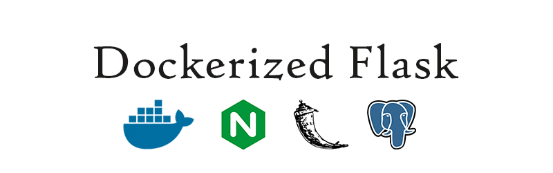

    

    Dockerized web app template using NGINX, Flask, and PostgreSQL.

    

    .
    ├── LICENSE
    ├── README.md
    ├── docker-compose.yml
    ├── dockerized_logo.png
    ├── flask
    │   ├── Dockerfile
    │   ├── config.py
    │   ├── manage.py
    │   ├── project
    │   │   ├── __init__.py
    │   │   ├── controllers
    │   │   │   ├── __init__.py
    │   │   │   └── routes.py
    │   │   ├── models
    │   │   │   ├── __init__.py
    │   │   │   └── names.py
    │   │   ├── static
    │   │   │   ├── css
    │   │   │   ├── img
    │   │   │   └── js
    │   │   └── templates
    │   │       └── index.html
    │   ├── requirements.txt
    │   └── tests
    │       ├── __init__.py
    │       ├── test_configs.py
    │       └── test_website.py
    ├── nginx
    │   ├── Dockerfile
    │   ├── app.conf
    │   └── nginx.conf
    └── postgres
        ├── Dockerfile
        └── create.sql

---

## Installation
* [Windows 10 (64-bit Pro)](https://github.com/Radu-Raicea/Dockerized-Flask/wiki/%5BInstallation%5D-Windows-10-Instructions-(64-bit-Pro))
* [Windows Toolbox](https://github.com/Radu-Raicea/Dockerized-Flask/wiki/%5BInstallation%5D-Windows-Instructions-(Toolbox))
* [macOS (Yosemite 10.10.3 and higher)](https://github.com/Radu-Raicea/Dockerized-Flask/wiki/%5BInstallation%5D-macOS-Instructions-(Yosemite-10.10.3-and-higher))
* [Linux (Ubuntu 16.04)](https://github.com/Radu-Raicea/Dockerized-Flask/wiki/%5BInstallation%5D-Linux-Instructions-(Ubuntu-16.04))

## Flask
* [Using Flask Script to run commands while application is running](https://github.com/Radu-Raicea/Dockerized-Flask/wiki/%5BFlask%5D-Using-Flask-Script-to-run-commands-while-the-application-is-running)
* [Running unit tests with Flask Testing and coverage](https://github.com/Radu-Raicea/Dockerized-Flask/wiki/%5BFlask%5D-Running-unit-tests-with-Flask-Testing-and-coverage)

## Docker
* [Remove all Docker volumes to delete the database](https://github.com/Radu-Raicea/Dockerized-Flask/wiki/%5BDocker%5D-Remove-all-Docker-volumes-to-delete-the-database)
* [Access the PostgreSQL command line terminal through Docker](https://github.com/Radu-Raicea/Dockerized-Flask/wiki/%5BDocker%5D-Access-the-PostgreSQL-command-line-terminal-through-Docker)

## Other
* [Access the PostgreSQL database using a 3rd party software](https://github.com/Radu-Raicea/Dockerized-Flask/wiki/%5BOther%5D-Access-the-PostgreSQL-database-using-a-3rd-party-software)
